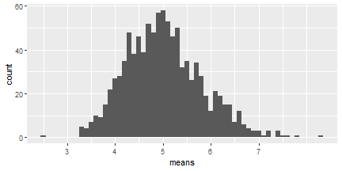
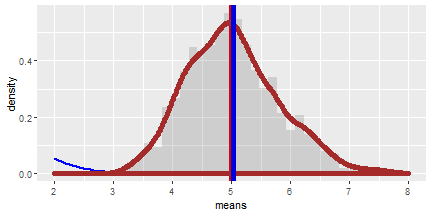
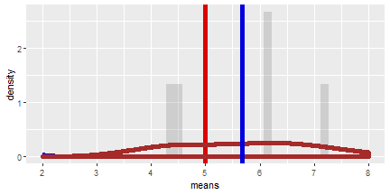
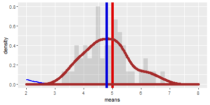
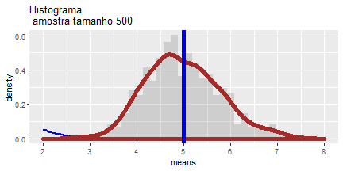
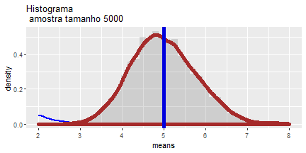

# Inferência estatítisca: Teorema do Limite Central

## O Teorema 


O Teorema do limite central afirma que quando o tamanho da amostra aumenta, a distribuição amostral da sua média aproxima-se cada vez mais de uma distribuição normal. Este resultado é fundamental para a inferência estatística. 

Qualquer que seja a distribuição da variável de interesse para grande amostras, a distribuição das médias amostrais serão aproximadamente normalmente distribuídas, e tenderão a uma distribuição normal à medida que o tamanho de amostra crescer. 

A sua utilidade é de estimar os parâmetros como a média populacional ou o desvio padrão da média populacional a partir de uma amostra aleatória dessa população. 

## Observações Gerais da Simulação

Vamos investigar a distribuição exponencial com o R, e depois comparar com o Teorema do Limite Central. 

A distribuição exponencial pode ser simulada com R utilizando rexp(n, lambda), onde a variável lambda é a taxa de parâmetro. 

A média da distribuição exponencial é 1/lambda, bem como o desvio padrão também é 1/lambda.

Definindo lambda = 0.2 para todas as simulações, vamos investigar a distribuição das médias de 40 exponenciais, para isto vamos precisar de milhares de simulações. 


## Simulações (1000 valores aleatórios para 40 exp)


```r
library(ggplot2)
# contantes
lambda <- 0.2
n <- 40                # exponenciais
QuantSimul <- 1000     # quantidade de testes
set.seed(1507446545)   # setando o 'seed' para ser reproduzível 
# Rodando em N versus QuantSimul 
ExpDistrib      <- matrix(data=rexp(n * QuantSimul, lambda), nrow=QuantSimul)
ExpDistribMedias <- data.frame(means=apply(ExpDistrib, 1, mean))
```



## Obtendo Amostra média versus média teórica 

Veja que a média esperada $\\mu$ da distribuição exponecial da taxa $\\lambda$ é 

$\\mu= \\frac{1}{\\lambda}$ 


```r
mu <- 1/lambda
mu
```

```
## [1] 5
```

Sendo $\bar X$ a média média da amostra de 1000 simulações de 40 distribuições aleatórias. 

```r
GrandMeans <- mean(ExpDistribMedias$means)
GrandMeans
```

```
## [1] 5.020541
```

A média esperada é muito próxima da média da amostra.

## Variância da Amostra versus Variância Teórica

O desvio padrão esperado $\sigma$ de uma distribuição exponencial da taxa $\lambda$ é

$\\sigma = \\frac{1/\\lambda}{\\sqrt{n}}$ 


```r
sd <- (1/lambda)/sqrt(n)
sd
```

```
## [1] 0.7905694
```

A $Variancia$ do desvio padrão $\sigma$ é

$Variancia = \sigma^2$ 


```r
Variance <- sd^2
Variance
```

```
## [1] 0.625
```

- $Variancia_x$ é a variância da média da amostra de 1000 simulações de 40 distribuições aleatórias;  

- $\sigma_x$ é o correspondente desvio padrão.

```r
sd_x <- sd(ExpDistribMedias$means)
sd_x
```

```
## [1] 0.7946587
```

```r
Variance_x <- var(ExpDistribMedias$means)
Variance_x
```

```
## [1] 0.6314825
```

Os desvios padrões estão muito próximos, praticamente iguais.

## Distribuição e população média 

A população média e o desvio padrão com uma distribuição normal dos valores esperados:


```r
# plot 
ggplot(data = ExpDistribMedias, aes(x = means)) + 
  geom_histogram(binwidth=0.15, aes(y=..density..), alpha=0.2) + 
  stat_function(fun = dnorm, arg = list(mean = mu , sd = sd), colour = "blue", size=1) + 
  geom_vline(xintercept = mu, size=2, colour="#DD0000") + 
  geom_density(colour="brown", size=2) +
  geom_vline(xintercept = GrandMeans, size=2, colour="#0000DD") + 
  scale_x_continuous(breaks=seq(mu-3,mu+3,1), limits=c(mu-3,mu+3)) 
```




De acordo com o gráfico, a distribuição calculada das médias das distribuições exponenciais aleatórias da amostra (em azul) sobrepõe a distribuição normal dos valores esperados com base na variável lambda (em vermelho).


## Comparando tamanho de amostras diferentes (Lembrando que o teorema é valido para grandes amostras)


```r
QuantSimul <- 5 # quantidade de testes
ExpDistrib      <- matrix(data=rexp(n * QuantSimul, lambda), nrow=QuantSimul)
ExpDistribMedias <- data.frame(means=apply(ExpDistrib, 1, mean))
mu <- 1/lambda
GrandMeans <- mean(ExpDistribMedias$means)

ggplot(data = ExpDistribMedias, aes(x = means)) + 
  geom_histogram(binwidth=0.15, aes(y=..density..), alpha=0.2) + 
  stat_function(fun = dnorm, arg = list(mean = mu , sd = sd), colour = "blue", size=1) + 
  geom_vline(xintercept = mu, size=2, colour="#DD0000") + 
  geom_density(colour="brown", size=2) +
  geom_vline(xintercept = GrandMeans, size=2, colour="#0000DD") + 
  scale_x_continuous(breaks=seq(mu-3,mu+3,1), limits=c(mu-3,mu+3)) 
```



```r
QuantSimul <- 50 # quantidade de testes
ExpDistrib      <- matrix(data=rexp(n * QuantSimul, lambda), nrow=QuantSimul)
ExpDistribMedias <- data.frame(means=apply(ExpDistrib, 1, mean))
mu <- 1/lambda
GrandMeans <- mean(ExpDistribMedias$means)

ggplot(data = ExpDistribMedias, aes(x = means)) + 
  geom_histogram(binwidth=0.15, aes(y=..density..), alpha=0.2) + 
  stat_function(fun = dnorm, arg = list(mean = mu , sd = sd), colour = "blue", size=1) + 
  geom_vline(xintercept = mu, size=2, colour="#DD0000") + 
  geom_density(colour="brown", size=2) +
  geom_vline(xintercept = GrandMeans, size=2, colour="#0000DD") + 
  scale_x_continuous(breaks=seq(mu-3,mu+3,1), limits=c(mu-3,mu+3)) 
```



```r
QuantSimul <- 500 # quantidade de testes
ExpDistrib      <- matrix(data=rexp(n * QuantSimul, lambda), nrow=QuantSimul)
ExpDistribMedias <- data.frame(means=apply(ExpDistrib, 1, mean))
mu <- 1/lambda
GrandMeans <- mean(ExpDistribMedias$means)

ggplot(data = ExpDistribMedias, aes(x = means)) + 
  geom_histogram(binwidth=0.15, aes(y=..density..), alpha=0.2) + 
  stat_function(fun = dnorm, arg = list(mean = mu , sd = sd), colour = "blue", size=1) + 
  geom_vline(xintercept = mu, size=2, colour="#DD0000") + 
  geom_density(colour="brown", size=2) +
  geom_vline(xintercept = GrandMeans, size=2, colour="#0000DD") + 
  ggtitle("Histograma \n amostra tamanho 500") +
  scale_x_continuous(breaks=seq(mu-3,mu+3,1), limits=c(mu-3,mu+3)) 
```



```r
QuantSimul <- 5000 # quantidade de testes
ExpDistrib      <- matrix(data=rexp(n * QuantSimul, lambda), nrow=QuantSimul)
ExpDistribMedias <- data.frame(means=apply(ExpDistrib, 1, mean))
mu <- 1/lambda
GrandMeans <- mean(ExpDistribMedias$means)

ggplot(data = ExpDistribMedias, aes(x = means)) + 
  geom_histogram(binwidth=0.15, aes(y=..density..), alpha=0.2) + 
  stat_function(fun = dnorm, arg = list(mean = mu , sd = sd), colour = "blue", size=1) + 
  geom_vline(xintercept = mu, size=2, colour="#DD0000") + 
  geom_density(colour="brown", size=2) +
  geom_vline(xintercept = GrandMeans, size=2, colour="#0000DD") + 
  ggtitle("Histograma \n amostra tamanho 5000") +
  scale_x_continuous(breaks=seq(mu-3,mu+3,1), limits=c(mu-3,mu+3)) 
```



## Referências: 

Wikipedia: https://pt.wikipedia.org/wiki/Teorema_central_do_limite 

UFPR: http://www.leg.ufpr.br/~silvia/CE001/node38.html

Brian Caffo: https://leanpub.com/LittleInferenceBook

